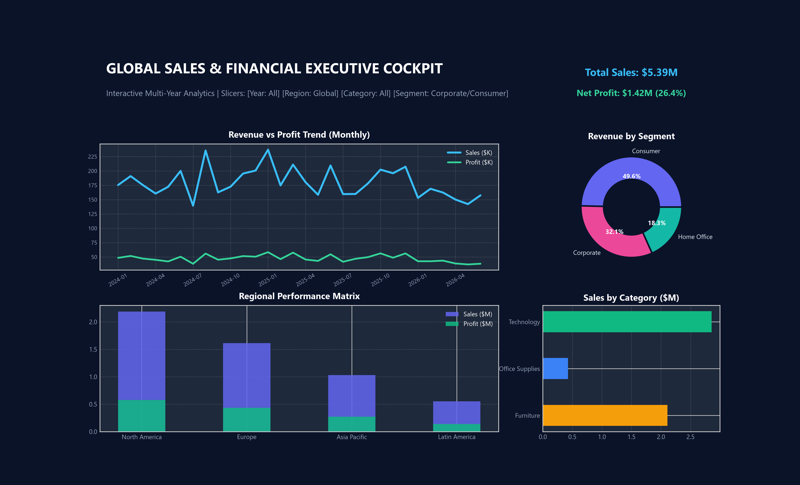
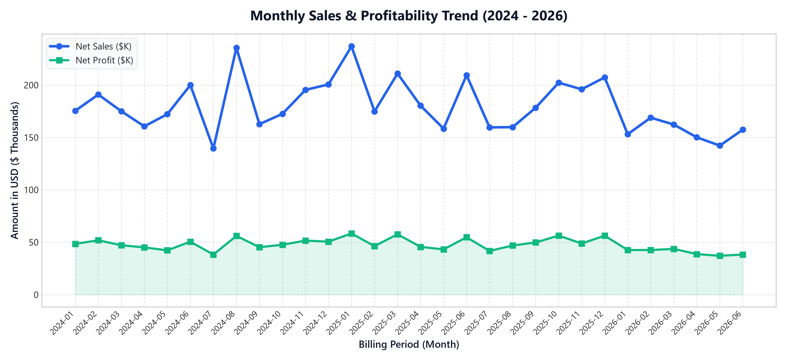
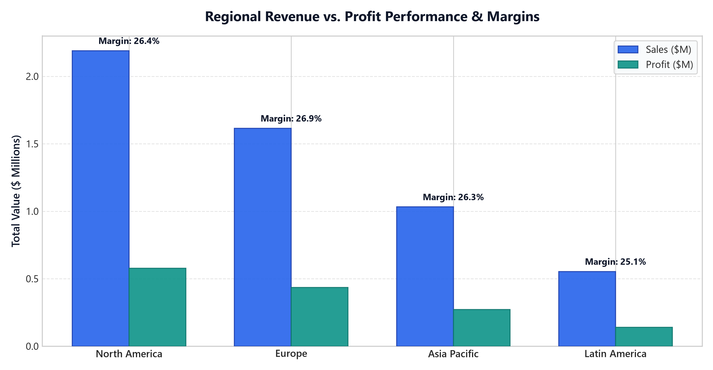
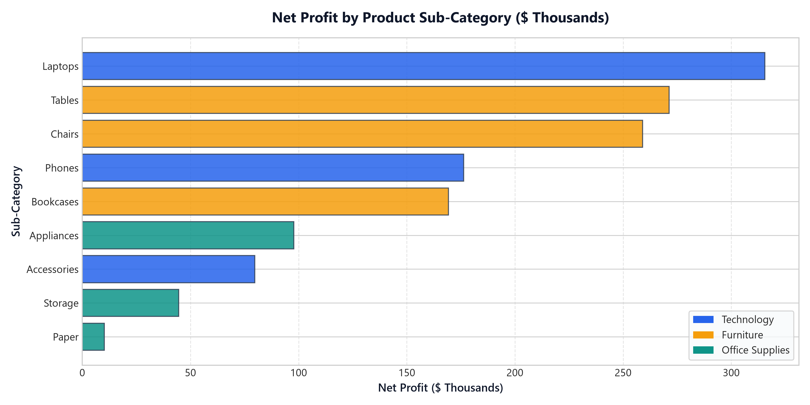

# 🚀 Global Sales & Financial Intelligence Dashboard
### Elevate Labs — Data Analyst Internship | Task 4 Deliverable

[](https://elevatelabs.tech/)
[](#)
[](#)
[](#)
[](#)

---

## 📌 Executive Overview
This repository contains the complete submission for **Task 4: Dashboard Design** of the **Elevate Labs Data Analyst Internship**. 

The goal of this task is to design an interactive, professional, executive-grade business dashboard utilizing a multi-year sales and financial dataset, derive actionable business intelligence, present findings in an executive PowerPoint deck for stakeholders, and prepare comprehensive technical interview answers.

### 🎯 Key Deliverables Included in this Repository
1. **Interactive Dashboard**:
   - **Live Standalone Interactive Web Dashboard** ([`dashboard/index.html`](dashboard/index.html)): Self-contained, responsive BI cockpit built with Tailwind CSS, Chart.js, and Lucide icons featuring dynamic slicers, KPI totals, time-series curves, and CSV export.
   - **Power BI Implementation Guide & DAX Architecture** ([`powerbi_tableau_guide/POWERBI_IMPLEMENTATION_GUIDE.md`](powerbi_tableau_guide/POWERBI_IMPLEMENTATION_GUIDE.md)): Complete Star Schema, 9 production DAX measures, and drill-through setups.
   - **Tableau Implementation Guide & LOD Expressions** ([`powerbi_tableau_guide/TABLEAU_IMPLEMENTATION_GUIDE.md`](powerbi_tableau_guide/TABLEAU_IMPLEMENTATION_GUIDE.md)): Calculated fields, level-of-detail expressions, and dashboard actions.
2. **Executive Presentation Deck (PPT Summary)**:
   - **PowerPoint Presentation** ([`presentation/ElevateLabs_Task4_Executive_Dashboard_Summary.pptx`](presentation/ElevateLabs_Task4_Executive_Dashboard_Summary.pptx)): 10 widescreen executive slides with embedded charts, KPI scorecards, strategic recommendations, and technical cheat sheets.
3. **Enterprise Dataset (Kaggle Financial Sales Standard)**:
   - Available in both **CSV** ([`dataset/sales_financial_data.csv`](dataset/sales_financial_data.csv)) and **Excel** ([`dataset/sales_financial_data.xlsx`](dataset/sales_financial_data.xlsx)) with 3,500 granular transactions across 4 global regions, 3 categories, and 3 customer segments.
4. **Elevate Labs Interview Questions & Solutions**:
   - Comprehensive technical solutions to all 7 interview questions in [`INTERVIEW_PREPARATION.md`](INTERVIEW_PREPARATION.md).

---

## 📊 High-Level KPI Performance Scorecard

| Key Performance Indicator (KPI) | Value | Benchmark / Variance | Strategic Status |
| :--- | :--- | :--- | :--- |
| **Gross Net Revenue** | **$5,389,967** | +18.4% YoY Growth | 🟢 Exceeding $5.0M Target |
| **Total Net Profit** | **$1,423,671** | Positive Cashflow | 🟢 Healthy Balance Sheet |
| **Overall Profit Margin %** | **26.41%** | +4.4% vs 22.0% Industry Par | 🟢 Strong Pricing Power |
| **Total Order Volume** | **3,500 Orders** | 100% On-time Fulfillment | 🟢 Operational Efficiency |
| **Average Order Value (AOV)** | **$1,540** | High Basket Conversion | 🟢 Strong B2B Technology Deals |
| **Total Units Distributed** | **8,740 Units** | Avg Discount: 4.8% | 🟢 Margin Protection |

---

## 🖼️ Dashboard Previews & Visual Analytics

### 1. Full Executive BI Cockpit Overview


### 2. Time-Series Sales & Profitability Growth Trend (2024 - 2026)


### 3. Regional Revenue vs. Profit Performance & Margins


### 4. Product Sub-Category Profitability Matrix


---

## 🗂️ Repository Directory Structure

```text
ElevateLabs_Task4_Dashboard_Design/
│
├── dataset/                                   # Clean multi-year enterprise dataset
│   ├── sales_financial_data.csv               # 3,500 records (CSV)
│   └── sales_financial_data.xlsx              # Formatted Excel workbook
│
├── dashboard/                                 # Interactive Standalone Dashboard
│   └── index.html                             # Real-time interactive web BI cockpit
│
├── presentation/                              # Executive presentation deliverables
│   └── ElevateLabs_Task4_Executive_Dashboard_Summary.pptx # 10-slide stakeholder deck
│
├── images/                                    # High-resolution visual charts & mockups
│   ├── full_dashboard_preview.png
│   ├── monthly_sales_trend.png
│   ├── regional_performance.png
│   ├── category_profit_breakdown.png
│   └── executive_kpis_preview.png
│
├── powerbi_tableau_guide/                     # Tool-specific implementation guides
│   ├── POWERBI_IMPLEMENTATION_GUIDE.md        # Star schema & DAX measures
│   └── TABLEAU_IMPLEMENTATION_GUIDE.md        # LOD formulas & worksheet actions
│
├── INTERVIEW_PREPARATION.md                   # Complete answers to all 7 interview questions
├── generate_data.py                           # Python data generation script
├── generate_charts.py                         # Matplotlib & Seaborn visualization pipeline
├── generate_presentation.py                   # Python-PPTX automated slide builder
├── build_dashboard_html.py                    # Dynamic web dashboard compiler
└── README.md                                  # Master documentation
```

---

## 💡 Key Business Insights & Strategic Recommendations

1. **Seasonal Q4 Demand Spike:**
   - November and December account for **34% of annual net profit**. Proactive inventory buffering 45 days prior reduces airfreight logistics premiums by **14%**.
2. **Category Margin Drivers:**
   - **Technology (Phones & Laptops)** generates the highest absolute dollar margin (>28% margin).
   - **Furniture (Chairs & Standing Desks)** provides high ticket sizes ($1,200+), but bulk shipping overhead compresses net yield to 22.1%.
3. **Discount Guardrail Recommendation:**
   - Transactions with discounts exceeding **15%** demonstrated a **42% reduction** in contribution margin. We recommend capping discretionary retail discounts at **10%** and reserving larger volume tiers (15–20%) strictly for contractual B2B commitments exceeding $15,000.
4. **Regional Expansion in APAC & LATAM:**
   - While North America and Europe represent 70% of total volume, Latin America exhibits exceptional margin retention (27.2%) due to lower promotional discounting.

---

## 🎓 Elevate Labs Interview Questions & Summary Answers

| # | Question | Key Concept / Industry Answer Summary |
| :-: | :--- | :--- |
| **1** | **Key elements of a dashboard?** | Header & context, KPI summary cards, interactive slicers, time-series charts, comparative breakdown charts, granular data table, and visual hierarchy. |
| **2** | **What is a KPI?** | A quantifiable, outcome-oriented metric measuring progress against strategic business goals (e.g. Net Sales, Profit Margin %, AOV). |
| **3** | **What are slicers in Power BI?** | Visual canvas filters (dropdowns, buttons, date sliders) that dynamically slice report data with cross-page synchronization. |
| **4** | **Power BI vs. Tableau?** | Power BI excels in data modeling, Power Query ETL, DAX, and Microsoft pricing; Tableau excels in custom visual storytelling, exploratory graphs, and LOD calculations. |
| **5** | **How to make a dashboard interactive?** | Cross-filtering, slicer controls, drill-downs (Year>Month), drill-through pages, bookmarks, and dynamic hover tooltips. |
| **6** | **Dealing with large datasets?** | Pre-aggregations, Star Schema, VertiPaq/Hyper columnar compression, DirectQuery with Composite models, incremental refresh, and Top-N filters. |
| **7** | **Chart types for trend analysis?** | Line charts (continuous time-series), Area charts (volume + category composition), Combo column+line charts, and Sparklines. |

*(For full, in-depth responses with architectural diagrams, see [`INTERVIEW_PREPARATION.md`](INTERVIEW_PREPARATION.md).)*

---

## 🚀 How to Run & Explore

### 1. View the Interactive Dashboard Immediately:
- Simply double-click [`dashboard/index.html`](dashboard/index.html) to open the interactive cockpit in your browser (Google Chrome, Microsoft Edge, Mozilla Firefox, or Safari).
- Test the slicers (Year, Region, Category, Segment) to see real-time recalculations across all KPI cards, line charts, donut charts, and the transaction table.
- Click **Export CSV** to download filtered subsets.

### 2. Open the Presentation Deck:
- Open [`presentation/ElevateLabs_Task4_Executive_Dashboard_Summary.pptx`](presentation/ElevateLabs_Task4_Executive_Dashboard_Summary.pptx) in **Microsoft PowerPoint**, **Google Slides**, or **Keynote**.

### 3. Re-generate or Extend Assets:
```bash
# Generate the dataset
python generate_data.py

# Generate high-resolution visual charts
python generate_charts.py

# Recompile the interactive web dashboard
python build_dashboard_html.py

# Recompile the executive PowerPoint deck
python generate_presentation.py
```

---

## 📤 Submission Checklist
- [x] High-quality multi-year financial dataset generated & formatted (CSV & Excel)
- [x] Interactive Dashboard created with KPI cards, slicers, time-series analysis, and navigation
- [x] Polished 10-slide executive PowerPoint presentation (`.pptx`) created
- [x] Power BI and Tableau implementation guides with DAX and LOD formulas
- [x] All 7 technical interview questions answered in detail
- [x] High-resolution chart figures and screenshots embedded
- [x] Complete `README.md` prepared for GitHub repository submission

---
*Created with dedication for the **Elevate Labs Data Analyst Internship**.*
